# ReachInbox Scheduler

A production-grade **email job scheduler + dashboard**: schedule thousands of emails, send them through
multiple Ethereal SMTP senders with per-sender throttling and hourly limits, survive restarts without
losing or duplicating a single email, and watch it all happen live.

Built with **TypeScript · Express · BullMQ + Redis · PostgreSQL (Prisma) · Elasticsearch · React + Tailwind**.
No cron anywhere — every send time is a BullMQ delayed job.

> ▶ **Demo video:** _add link before submission_ · 📋 **Evidence for every claim below:** [`docs/VERIFICATION.md`](docs/VERIFICATION.md)

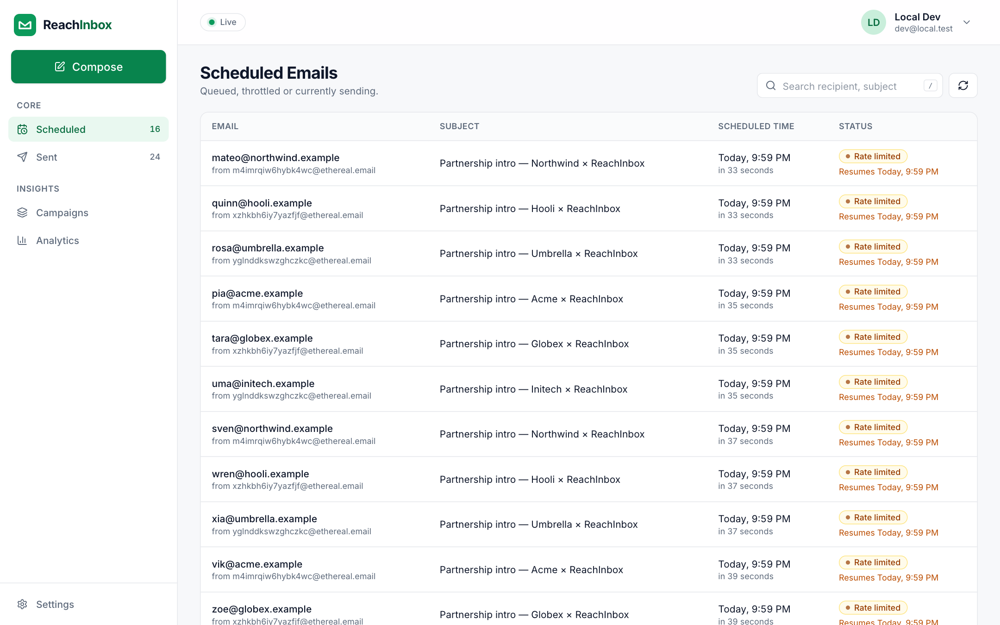

---

## Contents

1. [Highlights](#highlights)
2. [Quick start](#quick-start)
3. [Configuration](#configuration) — Google OAuth, Slack, Ethereal, env vars
4. [Running each part](#running-each-part)
5. [Architecture](#architecture) — scheduling · persistence · idempotency · rate limiting & concurrency · load
6. [Features](#features) — backend, frontend, beyond the brief
7. [Screenshots](#screenshots)
8. [API](#api)
9. [Testing & verification](#testing--verification)
10. [Assumptions, shortcuts & trade-offs](#assumptions-shortcuts--trade-offs)

---

## Highlights

|                              | Measured on real Ethereal SMTP, except Slack (see [`docs/VERIFICATION.md`](docs/VERIFICATION.md))                                                                                                                                    |
| ---------------------------- | ------------------------------------------------------------------------------------------------------------------------------------------------------------------------------------------------------------------------------------ |
| **Never sends twice**        | 0 duplicate Message-IDs across a worker `kill -9`, an API `kill -9`, a Redis restart and two competing workers                                                                                                                       |
| **Survives restarts**        | Delayed jobs persist in Redis (AOF); a one-shot boot reconciler repairs any drift from Postgres                                                                                                                                      |
| **Strict throttling**        | Min gap between two sends of one sender: **2,034 ms** measured for a 2,000 ms setting                                                                                                                                                |
| **Hourly limits under load** | 1,000 emails due at once → **0 dropped**, exactly 4/sender/window in demo mode, the rest deferred in order                                                                                                                           |
| **Slack alert**              | OAuth flow, encrypted token storage and one alert per sender per window are built and tested against a mocked Slack API (11 tests); a live run against real Slack needs your own Slack app ([setup below](#slack-rate-limit-alerts)) |
| **Quality gates**            | 231 tests · strict TypeScript · ESLint · `npm audit` 0 vulns · axe WCAG 2.1 AA 0 violations (both themes) · CI                                                                                                                       |

---

## Quick start

**Prerequisites:** Node 20+ and Docker Desktop.

```bash
npm install          # also builds the shared package and generates the Prisma client
npm run setup        # .env with fresh secrets → Postgres/Redis/ES → migrations → 3 Ethereal senders → search index
npm run dev          # API :4000 + worker + web :5173
```

Open **http://localhost:5173**. Google login needs `GOOGLE_CLIENT_ID/SECRET` in `.env` ([2 minutes, below](#google-oauth-required-for-login)).

**Demo mode** — the same app with 60-second "hours" so rate limiting is visible immediately (4 emails/sender/window, ≥ 2 s apart):

```bash
npm run dev:demo
npm run demo -w @ri/api -- load            # 1,000 emails at once → watch the throttling table
npm run demo -w @ri/api -- reset --yes     # clean slate before recording
```

`npm run setup` is idempotent: re-run it any time. Host ports are offset to avoid clashing with local
installs: **Postgres 5434, Redis 6380, Elasticsearch 9200**.

---

## Configuration

### Google OAuth (required for login)

1. [Google Cloud Console](https://console.cloud.google.com/apis/credentials) → **Create credentials → OAuth client ID → Web application**.
2. Authorized redirect URI: `http://localhost:4000/api/auth/google/callback`
3. Put the client ID/secret in `.env`, restart `npm run dev`.

Scopes are `openid email profile`; the header shows the user's name, email and Google avatar.

### Slack (rate-limit alerts)

Slack requires an HTTPS redirect, so expose the API with a tunnel:

```bash
brew install cloudflared
cloudflared tunnel --url http://localhost:4000      # copy the https://….trycloudflare.com URL
```

1. [api.slack.com/apps](https://api.slack.com/apps) → **Create New App → From scratch**.
2. **OAuth & Permissions** → Redirect URL `https://<tunnel>/api/slack/oauth/callback`; bot scopes `incoming-webhook`, `chat:write`.
3. `.env`: `SLACK_CLIENT_ID`, `SLACK_CLIENT_SECRET`, `SLACK_REDIRECT_URI=https://<tunnel>/api/slack/oauth/callback`; restart.
4. In the app: **Settings → Connect Slack** → pick a channel → **Send test message**.

Not connected? Rate-limit hits are recorded and simply not sent to Slack (no errors). Connecting,
disconnecting and reconnecting take effect immediately — no redeploy.

### Ethereal (fake SMTP)

Nothing to do: `npm run setup` creates 3 [Ethereal](https://ethereal.email) accounts via
`nodemailer.createTestAccount()` and stores them as senders (passwords AES-256-GCM encrypted). Every sent
email has an **Open in Ethereal** link in the dashboard. More senders: `npm run senders:create -w @ri/api -- --count 2`.

### Environment variables

All tunables live in `.env` ([`.env.example`](.env.example) documents each). Nothing is hard-coded.

| Variable                                                     | Default            | Meaning                                                                  |
| ------------------------------------------------------------ | ------------------ | ------------------------------------------------------------------------ |
| `WORKER_CONCURRENCY`                                         | `5`                | Parallel jobs per worker process                                         |
| `MIN_DELAY_BETWEEN_EMAILS_MS`                                | `2000`             | **Minimum gap between two sends from the same sender**                   |
| `MAX_EMAILS_PER_HOUR_PER_SENDER`                             | `50`               | Per-sender limit per window                                              |
| `MAX_EMAILS_PER_HOUR`                                        | `200`              | Global limit per window (all senders)                                    |
| `RATE_WINDOW_SECONDS`                                        | `3600`             | Window length (60 in demo mode)                                          |
| `EMAIL_MAX_ATTEMPTS`                                         | `3`                | SMTP attempts (exponential backoff) before `FAILED`                      |
| `STALE_SENDING_MS`                                           | `300000`           | A send interrupted by a crash is marked failed after this, never re-sent |
| `ADMIN_EMAILS`                                               | _(empty)_          | Who may open Bull Board; empty = any signed-in user                      |
| `DATABASE_URL`, `REDIS_URL`, `ELASTICSEARCH_URL`, `ES_INDEX` | local Docker       | Infra                                                                    |
| `JWT_SECRET`, `ENCRYPTION_KEY`                               | generated by setup | Session signing; AES-256-GCM key for secrets at rest                     |
| `GOOGLE_*`, `SLACK_*`                                        | —                  | OAuth apps (above)                                                       |

The per-campaign **hourly limit** and **delay between emails** are chosen in the compose form.

---

## Running each part

| Part                                 | Command                                                                               | Notes                                                                  |
| ------------------------------------ | ------------------------------------------------------------------------------------- | ---------------------------------------------------------------------- |
| Postgres, Redis (AOF), Elasticsearch | `docker compose up -d`                                                                | or `npm run infra:up`                                                  |
| API (Express)                        | `npm run dev:api`                                                                     | http://localhost:4000 · health `/healthz` · Bull Board `/admin/queues` |
| BullMQ worker                        | `npm run dev:worker`                                                                  | separate process — run several for horizontal scale                    |
| Web (Vite + React)                   | `npm run dev:web`                                                                     | http://localhost:5173 (proxies `/api`, `/admin`)                       |
| Production build                     | `npm run build` then `npm run start -w @ri/api` and `npm run start:worker -w @ri/api` | web output in `apps/web/dist`                                          |

The API and the worker are deliberately separate processes: either can be stopped, crashed or scaled
without affecting the other (proven in drills A–D).

---

## Architecture

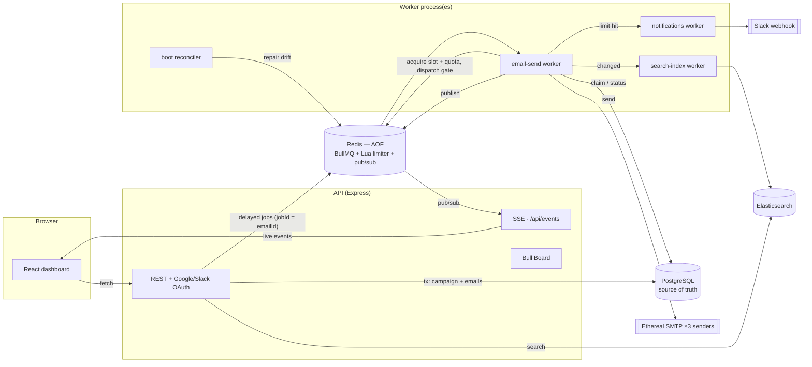

**Postgres is the source of truth. Jobs carry only an email id.** Everything the worker needs is read
from the row when the job runs, so a job can never act on stale data.

### How scheduling works

1. `POST /api/campaigns` validates input (shared zod schema), normalises leads (trim, lowercase, dedupe,
   report invalid), renders `{{merge_tags}}` per lead, assigns senders round-robin, and computes each
   email's time as `startAt + i × delayBetweenEmails`.
2. One Postgres transaction writes the campaign, its emails and a `SCHEDULED` event per email.
3. After commit, each email becomes a **BullMQ delayed job**: `jobId = emailId`, `delay = scheduledAt − now`
   (bulk-added in chunks of 500). No cron, no polling — Redis wakes the job at its time.
4. The worker runs the pipeline: **load row → skip if already done/cancelled/paused → throttle
   (atomic Redis) → claim row (conditional UPDATE) → SMTP → mark SENT → record event → re-index → push live update.**

### Persistence on restart

| Mechanism                                                           | What it guarantees                                                                                                                                                                                                |
| ------------------------------------------------------------------- | ----------------------------------------------------------------------------------------------------------------------------------------------------------------------------------------------------------------- |
| Redis runs with **AOF** (`appendonly yes`, `everysec`)              | Delayed jobs survive a Redis/container restart (drill C: 56 delayed jobs before and after)                                                                                                                        |
| Postgres holds every email and its status                           | The truth never lives only in Redis                                                                                                                                                                               |
| **Boot reconciler** (runs once when a worker starts — not periodic) | Re-enqueues any `SCHEDULED/RATE_LIMITED` row whose job is missing (Redis wiped, crash between DB commit and enqueue) with the **same jobId** and original time; past-due emails still go through the rate limiter |
| **Graceful shutdown** on SIGTERM/SIGINT                             | Stops taking jobs, lets in-flight sends finish, then closes queues/SMTP/DB (0 rows left `SENDING`)                                                                                                                |
| Throttle reservations are stored **on the job** (`job.updateData`)  | A reserved slot/quota survives a restart; an expired one is refunded                                                                                                                                              |

Future emails therefore still go out at the right time after a restart, and nothing restarts "from Day 1".

### Idempotency — the same email is never sent twice

| Layer    | Mechanism                                                                                                                                                |
| -------- | -------------------------------------------------------------------------------------------------------------------------------------------------------- |
| Queue    | `jobId = emailId` — BullMQ ignores a second add with the same id (double submit, reconciler race)                                                        |
| Database | Sending requires `UPDATE … SET status='SENDING' WHERE id=$1 AND status IN ('SCHEDULED','RATE_LIMITED')`; only one worker can win. `messageId` is unique. |
| Request  | `Idempotency-Key` header on `POST /api/campaigns` (stored 24 h in Redis) — replays return the original response                                          |
| SMTP     | Deterministic `Message-ID: <emailId@reachinbox.local>` makes any duplicate detectable                                                                    |

**Crash window (documented choice):** if a worker dies _after_ the SMTP server accepted a message but
_before_ the row says `SENT`, nobody can know whether it was delivered. Such rows are marked
`FAILED · interrupted_before_confirmation` once their lock is stale and are **never re-sent automatically**
— at-most-once is the right bias for cold email, where a duplicate hurts sender reputation more than a
miss. The user can retry it with one click.

### Rate limiting, delay & concurrency

**Delay between emails — minimum 2 seconds between sends from the same sender** (`MIN_DELAY_BETWEEN_EMAILS_MS=2000`).
Two layers:

- **Campaign spacing** (user's choice in the compose form): emails are scheduled `delay` seconds apart.
- **Provider throttle** (system guarantee), enforced in Redis:
  1. **Slot reservation** — an atomic Lua script hands each send the sender's next free slot
     (`max(now, nextFree)`, then `nextFree += minDelay`), so concurrent jobs queue up instead of colliding.
  2. **Dispatch gate** — right before SMTP, another atomic check allows the send only if `minDelay` has
     passed since that sender's _actual_ last dispatch. (Without it, a job that woke a few ms late
     squeezed the next gap to 1.97 s — we measured it and fixed it; now min 2,007 ms on Ethereal.)

**Emails per hour — Redis counters, three scopes, all enforced together** (fixed windows of `RATE_WINDOW_SECONDS`):

| Scope        | Limit                                                        | Redis key                    |
| ------------ | ------------------------------------------------------------ | ---------------------------- |
| Global       | `MAX_EMAILS_PER_HOUR`                                        | `rl:g:all:{window}`          |
| Per sender   | `MAX_EMAILS_PER_HOUR_PER_SENDER` (or the sender's own limit) | `rl:s:{senderId}:{window}`   |
| Per campaign | hourly limit from the compose form                           | `rl:c:{campaignId}:{window}` |

One Lua script checks all three and increments **all or none** — a blocked email consumes neither quota
nor a slot. Because every decision is a single atomic Redis call, it is correct across any number of
workers and machines (drill D: two processes, 0 duplicates, 500 ms min gap held across them). Nothing is
counted in memory. A failed SMTP attempt refunds its quota.

**When a limit is hit, the email is never dropped or failed.** It becomes `RATE_LIMITED` and is moved with
`job.moveToDelayed()` (BullMQ's `DelayedError`, which doesn't consume a retry) to
`nextWindowStart + rank × minDelay`, where `rank` is an atomic per-window counter — so emails that
overflowed first go first, and the next window starts evenly instead of stampeding. At the same moment the
first hit per sender per window triggers the Slack message and an in-app toast.

**Why not BullMQ's built-in `limiter`?** It is queue-global (one rate for every sender) and has no notion
of hourly windows with ordered rollover. It remains the simpler option for a single-sender system.

**Worker concurrency** is `WORKER_CONCURRENCY` per process; shared state is only in Redis (atomic Lua)
and Postgres (conditional updates), so parallel jobs and multiple processes are safe.

### Behaviour under load (1,000+ emails at the same time)

With the defaults (3 senders × 50/hour, 200/hour global, 2 s spacing), 1,000 emails due at 10:00:

- Insert: one transaction; enqueue: 2 × `addBulk(500)`. Redis holds ~1 KB per job.
- 10:00: each sender sends one email every 2 s → 150 go out in ~100 s, then each sender's hourly limit
  trips → **3 Slack alerts** → the other 850 move to the 11:00, 12:00… windows **in order**.
- Drain time ≈ 1,000 / 150 per hour ≈ 7 hours — deterministic and visible in Bull Board as delayed jobs.

Measured in demo mode (`npm run demo -w @ri/api -- load`): 1,000 due at once → 988 deferred within 9 s,
**exactly 4 per sender per window**, min gap **2,034 ms**, **0 duplicates** ([full table](docs/VERIFICATION.md#rate-limiting-under-load)).
Cancelling the remaining 976 took 0.18 s.

### Search, live updates, Slack

- **Elasticsearch:** every status change enqueues an idempotent re-index that rebuilds the document from
  Postgres. Search is tenant-filtered, prefix-as-you-type first, falling back to typo-tolerant matching
  (flagged "approximate"); results are then read from Postgres so status is always current. Highlights
  use control-character markers rendered as text (no HTML injection). Rebuild anytime: `npm run reindex -w @ri/api`.
- **Live dashboard:** worker → Redis pub/sub (one channel per user) → Server-Sent Events → the browser
  refetches (coalesced to ≤ 1 per 400 ms). Polling remains only as a fallback.
- **Slack:** OAuth v2 with a signed, expiring `state`; webhook + bot token encrypted at rest; a dead webhook
  is marked invalid and the UI asks to reconnect; transient Slack errors retry from their own queue.

---

## Features

### Backend — required

| Requirement                                                             | Where                                                               |
| ----------------------------------------------------------------------- | ------------------------------------------------------------------- |
| Express + TypeScript API                                                | `apps/api/src/app.ts`                                               |
| Store in Postgres                                                       | `apps/api/prisma/schema.prisma`                                     |
| BullMQ delayed jobs, **no cron** (CI-enforced: `npm run check:no-cron`) | `queues/queues.ts`, `scripts/check-no-cron.mjs`                     |
| Multiple senders via Ethereal SMTP                                      | `mail/transport.ts`, `scripts/create-ethereal-senders.ts`           |
| Searchable via Elasticsearch                                            | `modules/search/emailSearch.ts`                                     |
| Live BullMQ dashboard                                                   | Bull Board at `/admin/queues`                                       |
| Persistence across restarts, no duplicates                              | `recovery/reconciler.ts`, `queues/emailProcessor.ts`                |
| Configurable worker concurrency                                         | `WORKER_CONCURRENCY`                                                |
| Minimum delay between sends                                             | `throttle/rateLimiter.ts` (slot + dispatch gate)                    |
| Hourly limit, Redis-backed, safe across workers, deferred in order      | `throttle/rateLimiter.ts`                                           |
| Slack OAuth + alert on limit, no crash when disconnected                | `modules/slack/*`                                                   |
| Idempotency                                                             | jobId, conditional claim, Idempotency-Key, deterministic Message-ID |

### Frontend — required

| Requirement                                                                        | Where                                                          |
| ---------------------------------------------------------------------------------- | -------------------------------------------------------------- |
| Real Google login; header with name, email, avatar; logout                         | `pages/LoginPage.tsx`, `components/layout/Header.tsx`          |
| Dashboard with Scheduled / Sent and a Compose button                               | `components/layout/*`, `pages/EmailListPage.tsx`               |
| Compose: subject, body, CSV/TXT upload with count, start time, delay, hourly limit | `pages/ComposePage.tsx`, `lib/csv.ts`                          |
| Scheduled table (email, subject, time, status) and Sent table (sent/failed)        | `components/email/EmailTable.tsx` (one table, two column sets) |
| Loading skeletons, empty states, error states, toasts                              | `components/ui/*`                                              |
| Reusable components, typed API (shared zod schemas validated at runtime)           | `components/ui/*`, `packages/shared`                           |

### Beyond the brief

| Feature                           | What you see                                                                                                                        |
| --------------------------------- | ----------------------------------------------------------------------------------------------------------------------------------- |
| **Live dashboard (SSE)**          | Rows change status and counters tick with no refresh; "Live" indicator                                                              |
| **In-app rate-limit alerts**      | Toast the moment a sender hits its limit, with the resume time                                                                      |
| **"Resumes at" badges**           | Deferred rows show when they'll send; "Paused" when their campaign is                                                               |
| **Email detail drawer**           | Full email, Message-ID, Ethereal link, and a status timeline                                                                        |
| **Campaigns page**                | Live progress bars; Pause / Resume / Cancel (pausing keeps order)                                                                   |
| **Retry failed / cancel one**     | One click from the drawer                                                                                                           |
| **Analytics**                     | Sent / failed / deferred tiles, hourly chart (+ table view), live per-sender quota meters                                           |
| **Merge tags**                    | `{{name}}`, `{{company}}`, any CSV column — click to insert                                                                         |
| **Upload report + ETA**           | "10 detected · 1 invalid · 1 duplicate", estimated finish time                                                                      |
| **Search with highlights**        | `/` to focus; typo-tolerant fallback                                                                                                |
| **System health**                 | DB / Redis / Search / live-stream status + Bull Board link                                                                          |
| **Compose preview + test send**   | The email exactly as a recipient sees it (merge tags highlighted), warnings for blank tags, and a real test email to a sender inbox |
| **Send forecast**                 | Window-by-window chart of when emails will actually go out under your limits, before you schedule                                   |
| **Do-not-contact list + guard**   | Blocked addresses (and optionally anyone emailed in the last N days) are skipped, and the report says how many                      |
| **Business-hours window**         | "Only send 9–5 in this time zone, weekdays" — night/weekend emails roll to the next opening, including deferred ones                |
| **CSV export + bulk retry**       | Download any list as CSV (formula-injection safe); "Retry N failed" on a campaign                                                   |
| **Ask Inbox (assistant)**         | Cmd+K palette and a docked side panel: ask about your data, or command changes that wait for a Confirm                              |
| **Light and dark themes**         | Light, dark ("space") or follow the system; chosen in the header or Settings → Appearance                                           |
| **One-command setup, demo tools** | `npm run setup`, `dev:demo`, `demo load / restart / verify / reset`                                                                 |

---

## Screenshots

|                                                                                                      |                                                                                                              |
| ---------------------------------------------------------------------------------------------------- | ------------------------------------------------------------------------------------------------------------ |
| 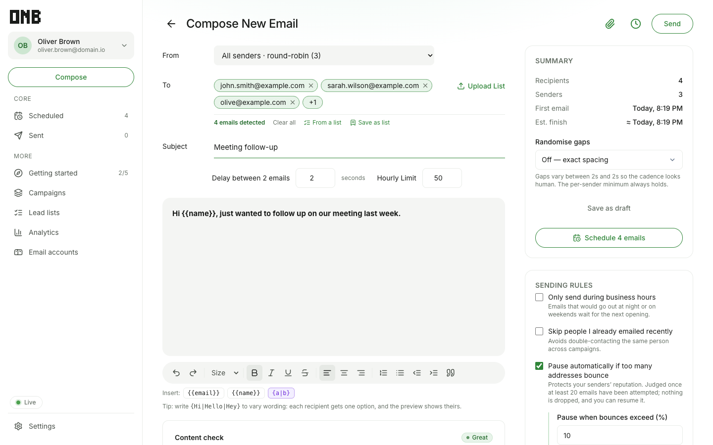 **Compose** — upload report, merge tags, ETA                | 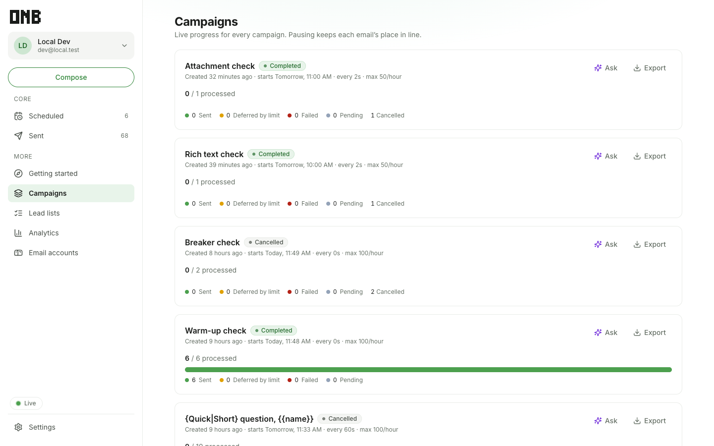 **Campaigns** — live progress, pause/resume/cancel              |
| 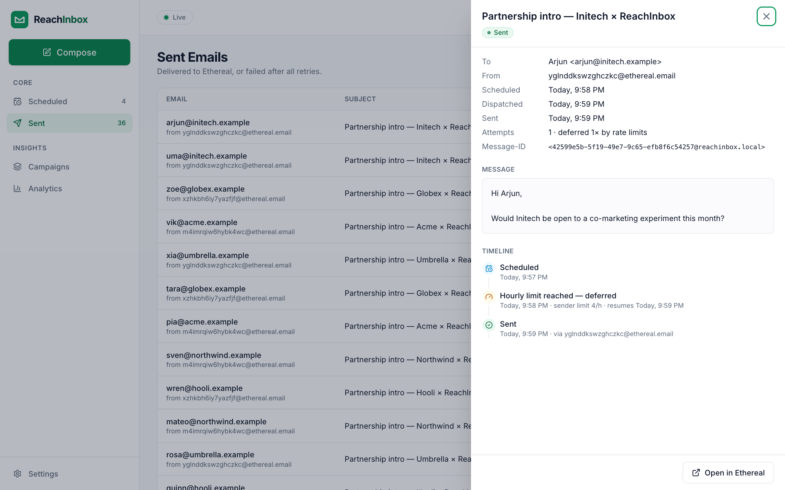 **Email detail** — timeline incl. rate-limit deferral         | 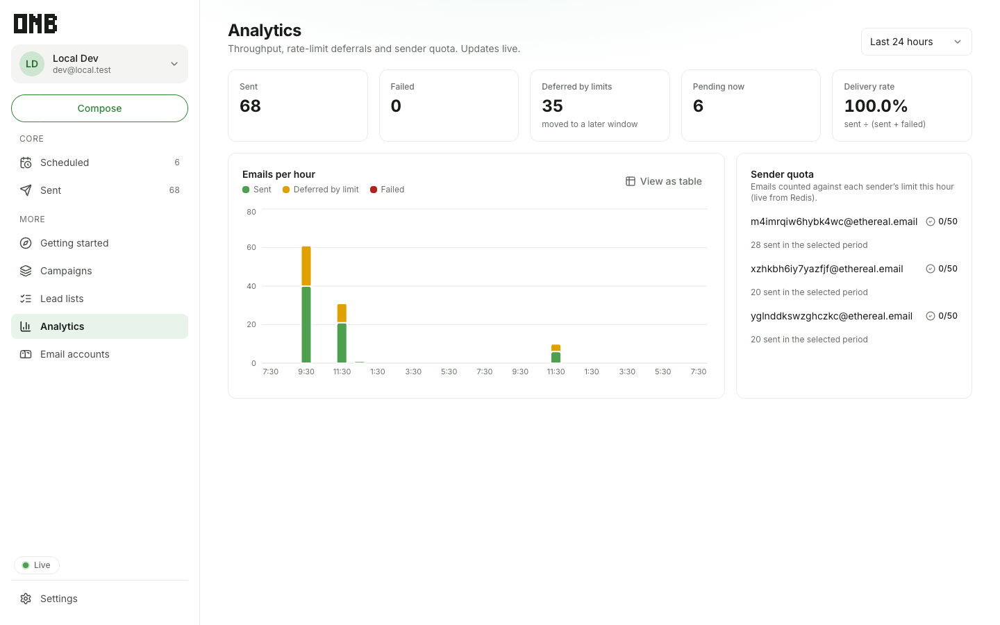 **Analytics** — live limit alert and quota meters               |
| 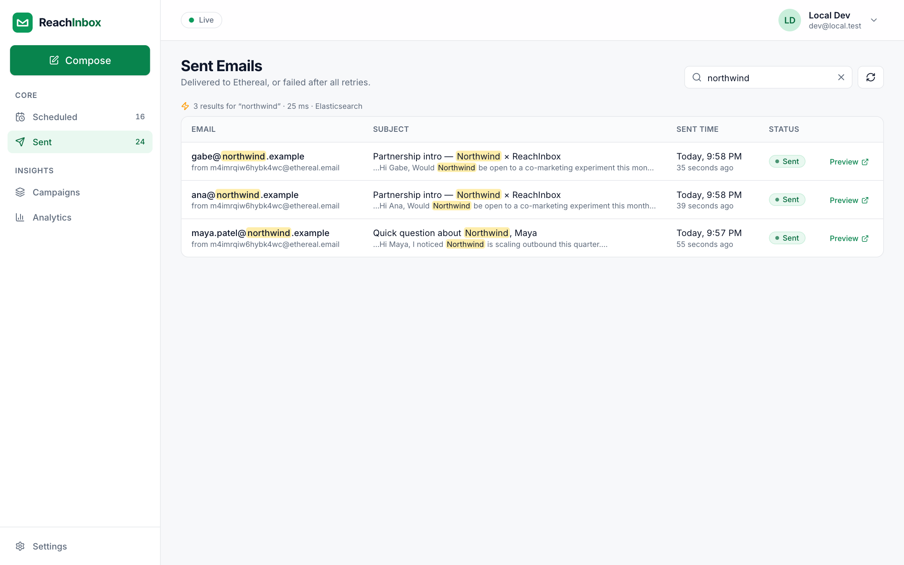 **Search** — Elasticsearch with highlights                    | 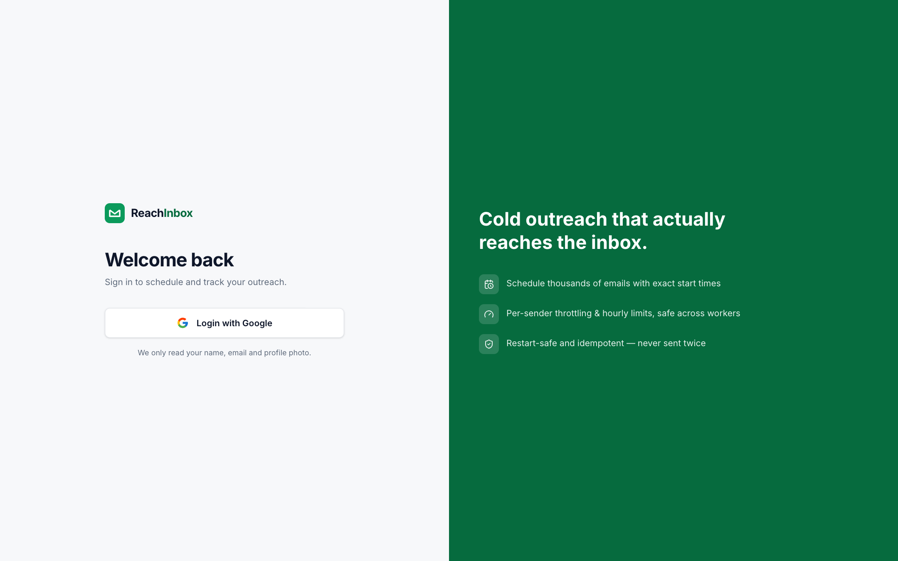 **Login** — Google OAuth                                                |
| 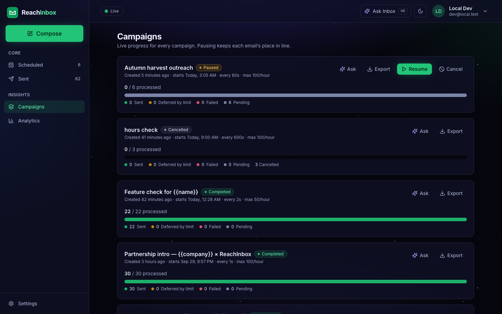 **Dark theme** — deep-space backdrop, frosted cards     | 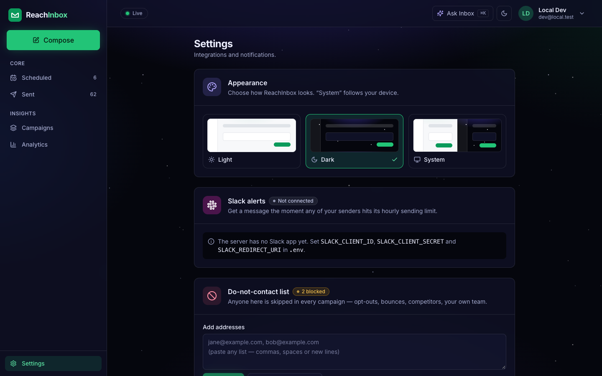 **Settings → Appearance** — light, dark, system |
| 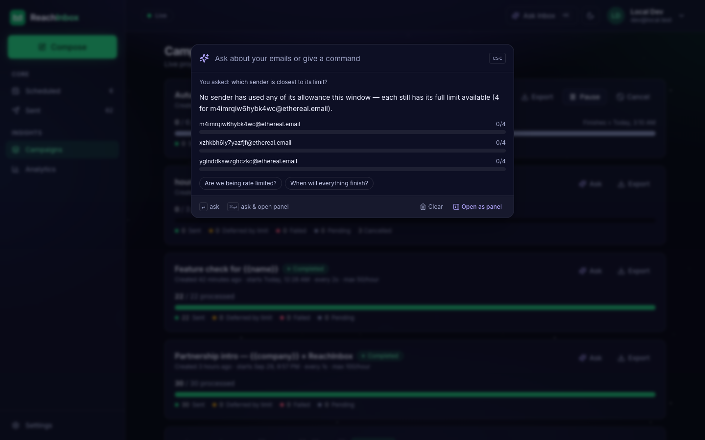 **Ask Inbox: Cmd+K palette** — quick answers | 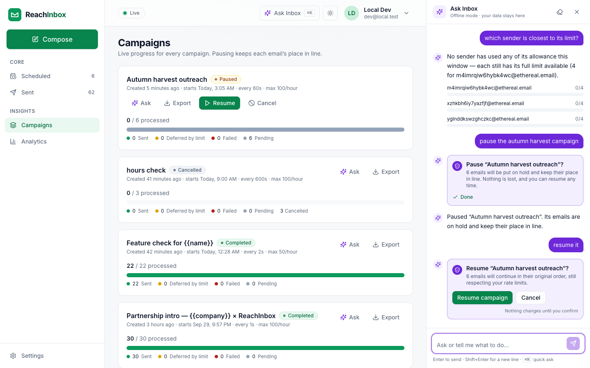 **Ask Inbox: side panel** — confirm before any change   |

---

## API

All routes except auth/health require the session cookie. Errors are always `{ error: { code, message, details? } }`.

| Method              | Path                                                                    | Purpose                                                                                                  |
| ------------------- | ----------------------------------------------------------------------- | -------------------------------------------------------------------------------------------------------- |
| GET                 | `/api/auth/google` → `/callback`                                        | Google OAuth (state-cookie CSRF protection)                                                              |
| GET / POST          | `/api/auth/me` · `/api/auth/logout`                                     | Current user · logout                                                                                    |
| POST                | `/api/campaigns`                                                        | Schedule (supports `Idempotency-Key`) → `{campaignId, accepted, invalid, duplicates, estimatedFinishAt}` |
| GET                 | `/api/campaigns`                                                        | Campaigns with per-status counts                                                                         |
| POST                | `/api/campaigns/:id/pause · resume · cancel`                            | Campaign controls                                                                                        |
| GET                 | `/api/emails?status=scheduled\|sent&cursor=&limit=`                     | Cursor-paginated lists                                                                                   |
| GET                 | `/api/emails/search?q=&status=`                                         | Elasticsearch search with highlights                                                                     |
| GET                 | `/api/emails/:id`                                                       | Detail + timeline                                                                                        |
| POST                | `/api/emails/:id/retry · cancel`                                        | Per-email actions                                                                                        |
| GET                 | `/api/emails/counts` · `/api/senders` · `/api/analytics?hours=`         | Badges · senders with live quota · analytics                                                             |
| GET / POST / DELETE | `/api/slack` · `/connect` · `/oauth/callback` · `/test`                 | Slack integration                                                                                        |
| POST                | `/api/campaigns/preflight` · `/test-send` · `/:id/retry-failed`         | Lead report + send forecast · one real test email · bulk retry                                           |
| GET / POST / DELETE | `/api/suppressions`                                                     | Do-not-contact list                                                                                      |
| GET                 | `/api/emails/export?tab=&status=&campaignId=`                           | Streamed CSV                                                                                             |
| POST / GET          | `/api/assistant/message` · `/actions/:id/confirm\|cancel` · `/starters` | Ask Inbox: answer, then confirm or decline a proposed change                                             |
| GET                 | `/api/events`                                                           | Server-Sent Events (per-user)                                                                            |
| GET                 | `/healthz`, `/admin/queues`                                             | Health · Bull Board                                                                                      |

---

## Testing & verification

```bash
npm test              # 231 tests: 217 API (real Postgres/Redis/Elasticsearch) + 14 web unit tests
npm run typecheck && npm run lint && npm run check:no-cron && npm audit
```

What the suites cover: exactly-once sending with two workers × concurrency 10; strict min delay;
rate-limit deferral order and single notification; boot reconciliation after Redis loses jobs; stale
`SENDING` → failed, never re-sent; SMTP failure → retries → `FAILED`; request idempotency; tenant
isolation (lists, detail, search, controls, live stream); search relevance and highlights; Slack OAuth,
encrypted storage, disconnect/reconnect, dead webhooks; pause/resume/cancel/retry; analytics; security
(redacted logs, JWT algorithm pinning, admin-only Bull Board, request throttling).

**Restart scenario** for yourself: `npm run demo -w @ri/api -- restart` schedules 20 emails 3 s apart and
walks you through stopping and restarting the servers; `-- verify <campaignId>` prints sent/pending,
duplicates, min gap and per-window counts. Drill results: [`docs/VERIFICATION.md`](docs/VERIFICATION.md).

CI (`.github/workflows/ci.yml`) runs the no-cron guard, lint, typecheck, migrations, all tests against
Postgres/Redis/Elasticsearch services, the build, and `npm audit`.

---

## Assumptions, shortcuts & trade-offs

- **Ask Inbox is rule-based ("offline mode"), on purpose.** It understands a defined set of English phrasings
  (≈ 90 tested), not free-form language, but it needs no API key, is deterministic, and can never invent a
  number: every answer is computed from your own data. Every change is _proposed_, and only carried out
  when you press Confirm (one-time, per user, audited in `AssistantAction`). A language-model mode could sit
  behind the same tools and confirm flow; it is not built.
- **Business hours** are whole hours in one IANA time zone. Deferred emails that wake outside the window wait for
  the next opening, so their exact order within that opening is best-effort rather than strict.
- **The "recently emailed" guard is off by default**, so re-uploading a test file behaves as expected; tick it in
  Compose to turn it on.
- **The forecast is an estimate** ("≈ finishes …"), built from the same limits the limiter uses, not a promise.

- **At-most-once on the crash window** (see [Idempotency](#idempotency--the-same-email-is-never-sent-twice)). With a
  real ESP this could be upgraded to exactly-once by looking the deterministic Message-ID up via the provider's API.
- **Fixed windows**, epoch-aligned (UTC hours by default), rather than sliding windows: simpler, cheap and
  predictable to explain ("resumes at 3:00"); a burst can straddle a boundary (≤ 2× limit across two adjacent windows).
- **"Tenant" = the signed-in user.** Senders are a shared pool; a global/sender limit alert goes to the
  owner of the campaign whose email hit it.
- **Elasticsearch is eventually consistent** (~1 s); results show fresh status because rows are read from Postgres.
  If ES is down, sending is unaffected and index jobs retry.
- **Pausing** removes pending jobs; a throttle reservation already taken in the current window isn't
  refunded (a tiny under-use of that window, never an over-send).
- **Stateless JWT sessions** (7 days): logout clears the cookie; there is no server-side revocation list.
- **Ethereal doesn't deliver** real mail — that's the point; everything is inspectable via preview links.
- **Slack locally needs a tunnel** because Slack only redirects to HTTPS.
- **`ADMIN_EMAILS` empty** means any signed-in user can open Bull Board (convenient locally; set it in production).
- **Demo mode** shrinks the window to 60 s; the UI still says "hourly" because that is the production meaning.

### Project structure

```
apps/api      Express API + BullMQ workers (Prisma, Lua limiter, Slack, Elasticsearch, SSE)
apps/web      React + Vite + Tailwind dashboard
packages/shared  zod schemas + types shared by both (API contract enforced at runtime)
scripts       setup, no-cron guard          docs  verification log, demo script, screenshots
```
